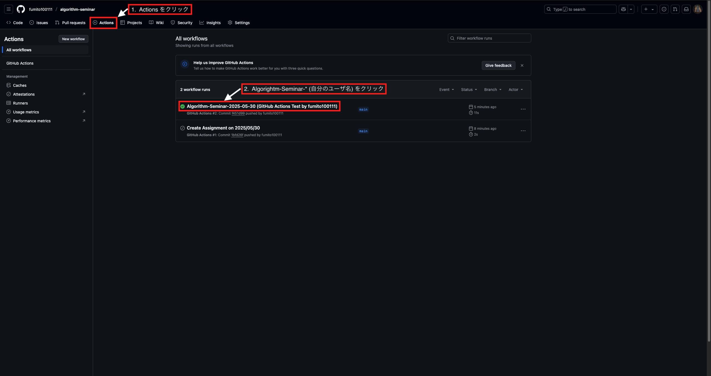
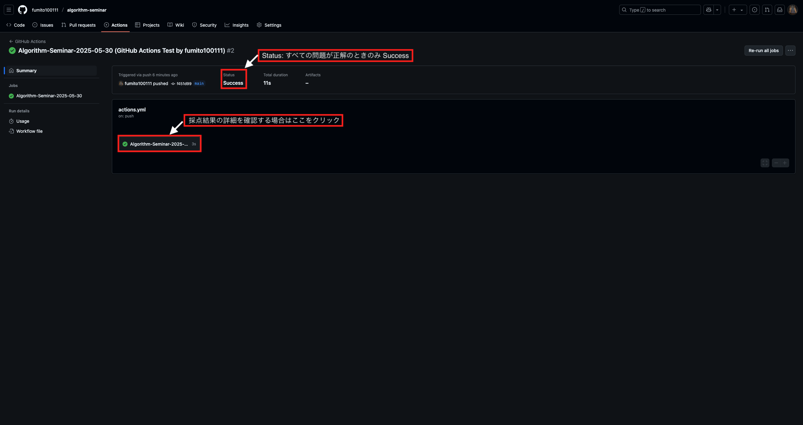
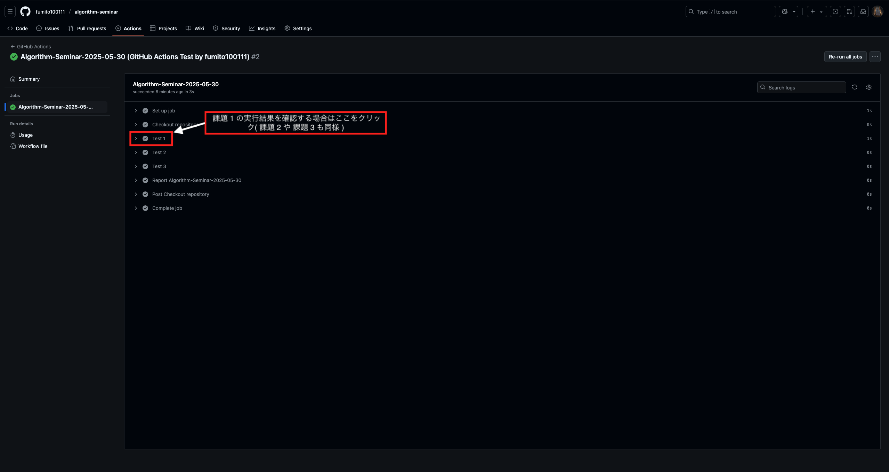
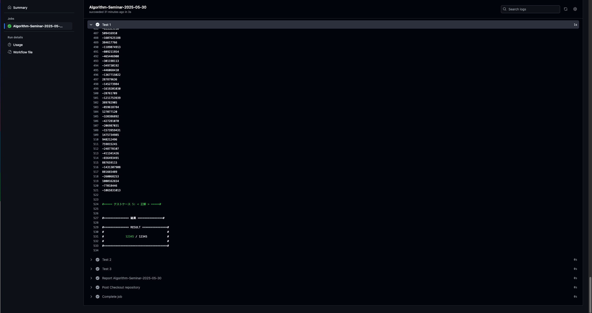
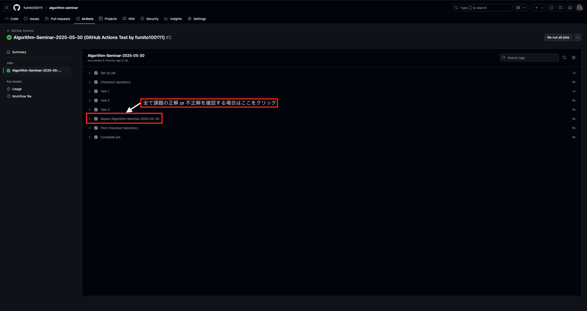
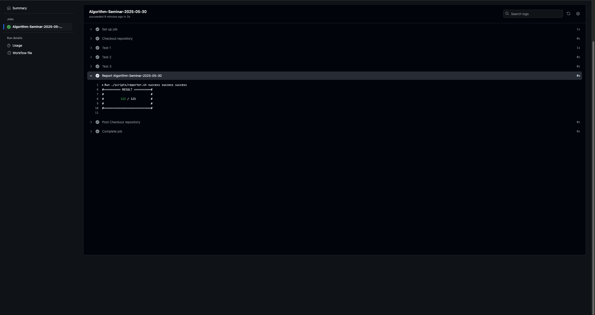

# アルゴリズム勉強会
## 開催日時
### <-----YEAR-----> / <-----MONTH-----> / <-----DAY----->: 13:00 ~

## 参加者
### 出題者
<-----CREATOR----->

### 回答者
<-----PARTICIPANTS----->
## 問題 (問題数: <-----ASSIGNMENTS-----> 問)
[リンク先タイトル](問題URL)

> [!TIP]
> 標準入力の方法が分からない場合, [Qiita (AtCoder+標準入力)](https://qiita.com/search?q=AtCoder+%E6%A8%99%E6%BA%96%E5%85%A5%E5%8A%9B) を参考になる.

## ローカル環境でのテスト方法
```zsh
make test DATE=< 課題の日付: デフォルトは今日 > ASSIGNMENT=< 課題番号 (全ての場合: ALL): デフォルトは ALL >

例) 課題の当日に全ての課題に関してテストを行う場合
    make test

例) 課題の当日に課題 1 だけテストを行う場合
    make test ASSIGNMENT=1
```

## 提出方法
```zsh
make submit
```

## 採点結果の確認方法
#### [GitHub Actions](https://github.com/fumito100111/algorithm-seminar/actions/) から提出した課題の採点結果を確認できる.

### GitHub Actions の確認方法


1. [GitHub Actions](https://github.com/fumito100111/algorithm-seminar/actions/) を開く
2. 最新の Workflow「 Algorithm-Seminar-<-----YEAR----->-<-----MONTH----->-<-----DAY-----> (自分のユーザ名) 」を開く



3. 採点結果の詳細を確認する場合は「 Algorithm-Seminar-<-----YEAR----->-<-----MONTH----->-<-----DAY-----> 」を開く

> [!TIP]
> 全ての課題が正解の場合, Status が Success になる.



4. それぞれの課題の実行結果を確認する場合は「 Test < 課題番号 > 」を開く



5. それぞれの課題のテストケースごとに入出力や正解, 実行エラーの詳細などを確認できる



6. 全ての課題の正解 or 不正解を確認する場合は「 Report Algorithm-Seminar-<-----YEAR----->-<-----MONTH----->-<-----DAY-----> 」を開く



7. 全ての課題の採点結果を確認できる


## 注意点
- 勉強会の目的のため, それぞれの言語の原則として標準ライブラリのみを使用すること.
- その他サイトから問題を持ってくる場合, 権利関連に注意すること.
- また, コンテストサイトなどから持ってくる場合, 開催中のコンテストからは持ってこないこと.
- 問題を解く際, ChatGPT や GitHub Copilot などの生成AI をコーディングに使用ないこと. (ただし, Web サイトで検索することは OK)